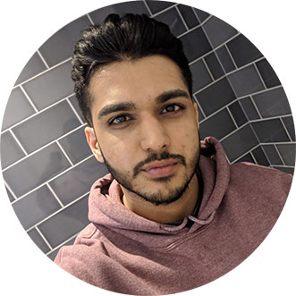

I'm Karan Thaker, a software engineer at Capgemini, and recent graduate of Aston University.

I started out as an apprentice at Capgemini back in 2013. After completing the 2 year apprenticeship, I moved onto a sponsored degree program which I completed in September 2018 and finished with First Class Honours all whilst maintaining my job at Capgemini.

I have 5 years experience in the field, working mostly with Java and supporting business-critical systems.

